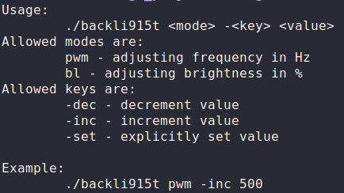

# backli915t
An utility to set backlight pwm frequency (abd brightness level) of displays, driven by Intel integrated GPUs with i915 driver.

### The project is under active development

#### API of first prototype:

